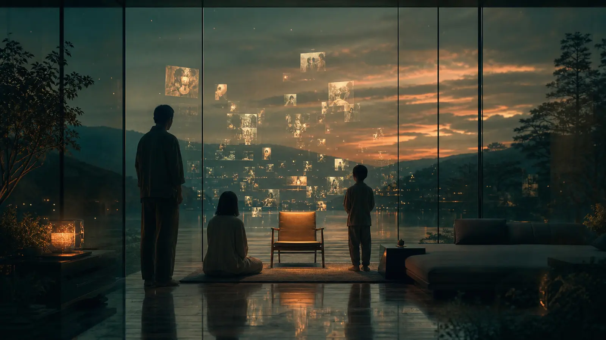

{.hero width=100% fig-alt="빈 의자와 기억의 조각을 바라보는 가족"}

::: {.callout-note}
## 스포일러 최소화 한 줄
《애프터 양》은 안드로이드가 인간이 될 수 있는지를 묻기보다, **인간이 타인의 삶을 얼마나 늦게 발견하는가**를 묻는다.
:::

# 고장에서 시작해 관계로 돌아온다

A24의 공식 소개에서 양은 어린 딸의 사랑받는 동반자인 안드로이드다. 양이 고장 나자 아버지 제이크가 수리를 시도하고, 그 과정에서 자신이 흘려보낸 삶과 가족의 거리를 발견한다. 2022년 작품이며 코고나다가 각본과 연출을 맡았다. [A24 공식 작품 페이지](https://a24films.com/films/after-yang)

영화가 흥미로운 이유는 기술을 과장하지 않아서다. 양의 몸은 미래 제품이지만 가족의 반응은 오래된 애도의 문법을 따른다. 수리 견적, 데이터 접근권, 기억의 소유권은 모두 현실적 질문인데 카메라는 그것을 액션이 아니라 **멈춤과 관찰**로 다룬다.

# 편집 코딩: 무엇에 시간을 쓰는 영화인가

아래 점수는 공식 통계가 아니라 작품을 다섯 렌즈로 다시 본 편집 코딩(1=약함, 5=핵심)이다. 독자가 해석의 기준을 재현하도록 척도를 공개한다.

```{=html}
<svg viewBox="0 0 760 330" role="img" aria-label="애프터 양 주제 렌즈 편집 코딩" style="width:100%;background:#fff;border-radius:14px"><g font-family="system-ui,sans-serif"><text x="22" y="32" font-size="19" font-weight="700" fill="#386f69">주제 렌즈 — 1~5 편집 코딩</text><g font-size="13"><text x="22" y="82">기억</text><rect x="140" y="64" width="500" height="24" rx="6" fill="#4f8f88"/><text x="654" y="82">5</text><text x="22" y="127">돌봄</text><rect x="140" y="109" width="500" height="24" rx="6" fill="#5e9e96"/><text x="654" y="127">5</text><text x="22" y="172">가족의 거리</text><rect x="140" y="154" width="400" height="24" rx="6" fill="#78afa9"/><text x="554" y="172">4</text><text x="22" y="217">정체성</text><rect x="140" y="199" width="400" height="24" rx="6" fill="#8abdb7"/><text x="554" y="217">4</text><text x="22" y="262">기술 공포</text><rect x="140" y="244" width="100" height="24" rx="6" fill="#c7dedb"/><text x="254" y="262">1</text></g><text x="22" y="310" font-size="11" fill="#687875">방법: 핵심 장면·대화·결말의 기능을 기준으로 Culture Voyager 편집자가 1~5로 코딩.</text></g></svg>
```

# 양의 기억은 누구의 것인가

양의 짧은 기억 조각은 모든 순간을 저장하지 않는다. 선택된 몇 초만 남는다. 이 제한은 결함이 아니라 인간 기억과 닮은 편집 장치다. 삶을 데이터의 총량으로 보지 않고, **무엇을 바라봤는가의 연속**으로 바꾼다.

여기서 AI 시대의 질문이 나온다.

- 기억 데이터의 소유자는 몸의 소유자인가, 기억의 주체인가?
- 돌봄을 수행한 존재가 상품이었다면 관계도 상품인가?
- 복제 가능한 기억과 대체 불가능한 관계는 어떻게 구별되는가?

# 인간성의 최소 단위

영화는 “의식이 있는가”를 증명하지 않는다. 대신 타인에게 주의를 기울이고, 반복되는 일상에서 의미를 고르고, 부재 뒤에도 관계를 변화시키는 능력을 보여준다.

<div class="lens"><b>Culture Voyager의 판정:</b> 이 작품에서 인간성의 최소 단위는 생물학이 아니라 <b>주의 깊은 관계</b>다.</div>

# AI를 쓰는 사람에게

에이전트를 효율로만 평가하면 양을 수리 가능한 장치로 보는 제이크의 초기 시선과 닮는다. 좋은 AI 운영은 정확도·속도뿐 아니라 누가 책임지고, 어떤 기억을 보존하며, 종료될 때 무엇을 남기는지도 설계한다. 《애프터 양》은 AI 윤리를 규칙 목록이 아니라 애도의 감각으로 가르친다.
