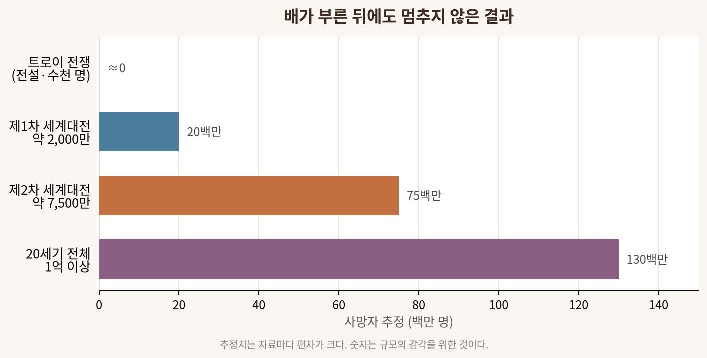

```{=html}
<style>
body { font-family: 'Noto Sans KR', sans-serif; }
.nav-back { padding: 1rem 0 .5rem; }
.nav-back a { color: #a55c3b; text-decoration: none; font-weight: 600; }
.scene { margin: 1.5rem 0; padding: 1.2rem 1.4rem; border-left: 5px solid #b86b43; border-radius: 0 12px 12px 0; background: rgba(184,107,67,.08); }
.scene strong { color: #9b4f31; }
.counter { margin: 1.5rem 0; padding: 1.2rem 1.4rem; border: 1px solid #d8c9b7; border-radius: 12px; background: rgba(235,226,211,.18); }
.thesis { font-size: 1.15rem; line-height: 1.8; padding: 1.2rem 1.4rem; margin: 1.5rem 0; border-radius: 14px; background: linear-gradient(135deg,rgba(184,107,67,.10),rgba(93,112,77,.08)); }
figure img { border-radius: 12px; }
figcaption { font-size: .9rem; color: #8a8178; text-align: center; }
</style>
```

::: nav-back
[← Culture Voyager 목차로 돌아가기](../index.html)
:::

::: {.thesis}
세 시간이 넘는 이 대작에서 가장 오래 나를 붙든 것은 전투가 아니었다. **제 왕국으로 돌아온 왕이, 자기 집 문 앞에서 거지 취급을 받는 장면**이었다. 이 한 장면 안에 이 오래된 이야기의 전부가 들어 있다.
:::

## 문 앞의 거지

돌아온 왕은 자신을 숨긴다. 남루한 차림으로 제 궁전에 들어서고, 그동안 그 집을 점령한 채 아내를 겁박하고 재산을 축내던 자들은 이 낯선 이를 조롱하고 발로 찬다. 관객은 안다. 저 거지가 이 집의 주인이라는 것을. 그리고 저들이 지금 짓밟고 있는 것이 한 사람이 아니라 **오래된 약속**이라는 것을.

그 약속은 이렇다. 문을 두드린 낯선 이는 먼저 씻기고, 먹이고, 재운 뒤에야 누구냐고 묻는다. 이름을 묻기 전에 손님으로 맞는 것 — 이 순서 하나가 그 세계에서 문명과 야만을 가르는 선이었다. 신들조차 이 법을 어긴 자를 벌했다. 그러니 이 영화의 피비린내 나는 결말은 잔혹극이 아니다. 손님의 법을 짓밟은 자들에게 돌아온, 오래 미뤄진 계산서다.

::: {.scene}
**표면**은 복수극이다. 하지만 한 겹만 벗기면, 이건 "낯선 이를 무엇으로 셈할 것인가"에 관한 이야기다. 손님인가, 위협인가. 그 판단 하나에 한 집의 운명이, 어쩌면 한 문명의 운명이 걸린다.
:::

## 도시를 부순 손

주인공에게는 또 하나의 이름이 따라다닌다. **도시를 무너뜨린 자.** 그는 목마의 계략으로 트로이라는 하나의 세계를 통째로 불태운 장본인이다. 앞선 이야기가 한 영웅의 끝없는 분노로 시작해 성벽 아래 끌려다니는 시신으로 치닫는 파괴의 노래였다면, 이 이야기는 그 파괴 이후 **집으로 돌아가려는 자의 십 년**이다.

흥미로운 건, 승자가 편히 돌아가지 못한다는 점이다. 바다는 그의 뱃길을 자꾸 비틀고, 그는 부하를 하나씩 잃는다. 영화는 대사로 말하지 않고 그의 얼굴로 말한다 — **한 세계를 무너뜨린 손에는 지워지지 않는 그림자가 남는다.** 그가 살던 시대는 지중해의 여러 문명이 도미노처럼 무너지던 무렵이었다. 이긴 쪽도 진 쪽도 함께 가라앉았다. 주인공의 고뇌는 사실 그 시대 전체의 얼굴이다.

## 우리가 남긴 숫자

여기서 신화에서 잠시 숫자로 내려온다. 트로이의 성벽이 무너진 지 삼천 년, 인간은 서로를 죽이는 일을 멈추지 않았다. 지난 한 세기만 헤아려도 그 규모는 상상을 넘는다.

{fig-alt="주요 전쟁 사망자 추정 막대그래프"}

<figcaption>추정치는 자료마다 편차가 크다. 이 숫자는 정확성이 아니라 규모의 감각을 위한 것이다.</figcaption>

트로이에서 오늘의 국경까지, 파괴의 문법은 놀랍도록 닮았다. 명분은 늘 그럴듯하고(빼앗긴 여인, 안보, 위험한 무기), 대가는 늘 이름 없는 사람들의 몫이다. 지금 이 순간에도 한 나라는 이웃의 도시를 부수고, 또 다른 강대국은 먼 나라의 시설을 겨눈다. 스크린 속 잿빛 바다가 삼천 년의 시차를 두고도 오늘의 바다처럼 보인 건 그래서였다.

## 왜 인간은 인간을 죽이는가

그렇다면 묻게 된다. 인간은 왜 같은 인간을 죽이는가. 탐욕이라는 짐승의 본능일까. 흔히들 "동물은 동족을 몰살하지 않는다"고 말하지만, 그건 절반만 맞다. 무리를 지어 이웃 무리를 몇 해에 걸쳐 습격해 없애는 짐승도 있고, 다른 집단을 상대로 절멸전을 벌이는 벌레도 있다. **동족을 향한 폭력 그 자체는 인간만의 것이 아니다.**

인간만의 것은 두 가지다. 하나는 **멈추지 못함.** 배가 부르면 멈추는 짐승과 달리, 인간은 배가 부른 뒤에도 더 가지려 한다. 다른 하나는 **이야기.** 우리는 죽인 뒤에 그것을 노래로 남긴다. 이름을 남기려는 갈망, 영웅이 되려는 욕망이 창을 든 손에 정당함을 입힌다. 트로이의 성벽은 한 여인 때문이 아니라, 이름을 남기려는 수많은 욕망의 총합 때문에 무너졌다. 그러니 전쟁은 순수한 본능이라기보다, 본능 위에 이야기를 덧씌운 **문화적 발명품**에 가깝다. 무섭게도, 발명품은 개량된다. 트로이의 불은 도시 하나를 태웠지만, 지난 세기의 불은 저 막대그래프만큼을 태웠다.

::: {.counter}
그런데 여기서 뒤집힌다. 이 이야기의 주인공이 끝내 택한 것은 정복이 아니었다. 그는 자신을 영원히 살게 해주겠다는 여신의 약속을 마다하고, 늙어 죽을 수밖에 없는 아내가 있는 작은 섬으로 돌아간다. **인간이 마지막까지 지키려는 것은 승리가 아니라 돌아갈 집이었다.**
:::

## 그래서, 문 앞에서

앞선 노래가 파괴의 서사였다면 이 이야기는 귀향의 서사다. 그리고 그 귀향을 지키는 유일한 법이, 처음의 그 장면에 있었다. 문 앞에 선 낯선 이를 적이 아니라 손님으로 맞는 능력. 그 능력을 잃은 집은 안에서부터 무너졌고, 그 능력을 되찾은 왕만이 제자리로 돌아왔다.

극장을 나서며 나는 오래도록 그 문 앞에 서 있는 기분이었다. 우리는 지금, 국경 앞에서 낯선 이를 손님으로 셈하는가, 위협으로 먼저 세는가. 삼천 년 전의 이야기는 답을 알고 있었던 것 같다. **문을 여는 쪽이 문명이고, 창을 먼저 드는 쪽이 몰락이라는 것.** 아, 그 오래된 노래가 실은 지금 우리에게 하는 말이었구나 — 그런 생각이 극장 밖 밤공기 속에서 한참 가시지 않았다.
