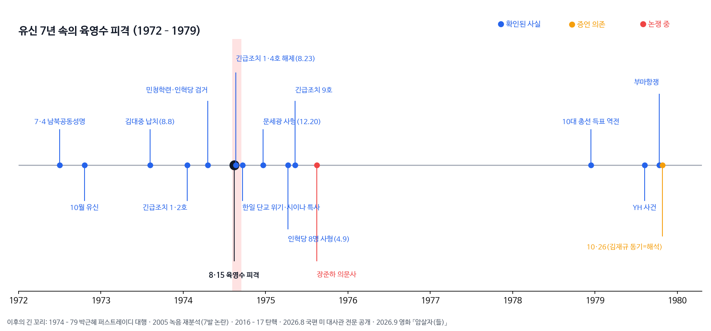

```{=html}
<style>
body { font-family: 'Noto Sans KR', sans-serif; }
.nav-back { padding: 1rem 0 .5rem; }
.nav-back a { color: #a55c3b; text-decoration: none; font-weight: 600; }
.scene { margin: 1.5rem 0; padding: 1.2rem 1.4rem; border-left: 5px solid #b86b43; border-radius: 0 12px 12px 0; background: rgba(184,107,67,.08); }
.scene strong { color: #9b4f31; }
.counter { margin: 1.5rem 0; padding: 1.2rem 1.4rem; border: 1px solid #d8c9b7; border-radius: 12px; background: rgba(235,226,211,.18); }
.thesis { font-size: 1.15rem; line-height: 1.8; padding: 1.2rem 1.4rem; margin: 1.5rem 0; border-radius: 14px; background: linear-gradient(135deg,rgba(184,107,67,.10),rgba(93,112,77,.08)); }
.memo { margin: 2rem 0; padding: 1.4rem; border: 2px dashed #c4703f; border-radius: 14px; }
.tag { display:inline-block; font-size:.78rem; padding:1px 8px; border-radius:999px; margin-right:.3rem; color:#fff; }
.t-fact { background:#2563eb; } .t-test { background:#d18b0f; } .t-dispute { background:#d9443a; }
figure img { border-radius: 12px; }
figcaption { font-size: .9rem; color: #8a8178; text-align: center; }
</style>
```

::: nav-back
[← Culture Voyager 목차로 돌아가기](../index.html)
:::

::: {.thesis}
아직 극장에 가지 않았다. 그래서 오늘은 영화가 아니라, 영화가 딛고 선 땅을 먼저 걷는다. 그 땅의 한가운데에는 **0.17초**가 있다. 1974년 광복절 기념식장에서 네 번째 총성이 울리고, 단상의 한 여인이 기울기 시작하기까지의 시간. 반세기 동안 이 나라는 그 0.17초 안에 무엇이 있었는지를 두고 다퉈 왔다. 영화 「암살자(들)」은 바로 그 틈에 카메라를 들이민다.
:::

이 글에서 사실의 무게는 색으로 구분한다. <span class="tag t-fact">확인</span>은 판결·공문서·복수의 1차 자료로 확인된 것, <span class="tag t-test">증언</span>은 관계자 진술에 기댄 것, <span class="tag t-dispute">논쟁</span>은 근거가 맞서거나 기록이 끊긴 것이다.

## 1974년 여름, 이 나라는

유신 2년째였다. 헌법은 대통령에게 국회 해산과 긴급조치라는 칼을 쥐여 주었고, 그해 1월부터 그 칼은 실제로 휘둘러졌다. 긴급조치 1·2호, 4월의 민청학련 사건, 그리고 그 배후로 지목된 '인혁당 재건위'. 학생들에게 사형이 구형되던 여름이었다. <span class="tag t-fact">확인</span>

바다 건너에서는 한 해 전 도쿄의 호텔에서 야당 지도자 김대중이 납치돼 닷새 만에 서울 집 앞에 버려진 일이 아직 식지 않았다. 중앙정보부의 조직적 범행이었다는 결론은 33년 뒤에야 나왔다. <span class="tag t-fact">확인</span> 일본은 자기 영토에서 벌어진 주권 침해에 분노했고, 한일 관계는 이미 금이 가 있었다.

그러면서도 공장은 돌았다. 중화학공업화 선언 이듬해였고, 1973년 첫 석유파동이 막 지나간 참이었다. 성장과 억압이 한 몸에 붙어 있던 시절. 이 영화를 보기 전에 기억해야 할 첫 번째 사실은, 그날의 총성이 **진공 속에서 울리지 않았다**는 것이다.



## 8월 15일 오전 10시 25분

서울 장충동 국립극장. 대통령의 경축사가 끝나 갈 무렵, 객석 뒤쪽에서 한 청년이 일어섰다. 재일교포 2세 문세광, 스물두 살. <span class="tag t-fact">확인</span>

그는 한 달 전 오사카의 한 파출소에서 38구경 권총을 훔쳤고, 동창의 남편 이름으로 만든 일본 여권으로 입국해 조선호텔에 묵었다. 로비에서 쏘려 했으나 시야가 막혀 객석 뒤에 앉았고, 앞으로 나가려다 첫 발은 자기 허벅지를 쐈다. <span class="tag t-fact">확인</span>

공식 발표로 그날 울린 총성은 일곱 번이다. 문세광의 다섯 번(오발·연단·불발·영부인·태극기 근처 벽)과 경호원의 응사 두 번. 영부인 육영수는 머리에 총상을 입고 그날 저녁 숨졌다. 그리고 거의 잊힌 이름이 하나 있다. 합창단으로 무대에 섰던 성동여실 2학년 **장봉화**. 그는 경호원의 총탄에 맞아 숨졌다. <span class="tag t-fact">확인</span>

문세광은 넉 달 만에 1심·항소·상고를 모두 거쳐 12월 20일 사형됐다. 법정에서 그는 대통령을 죽이지 못한 것을 후회하면서도, 무고한 여학생의 죽음에는 고개를 숙였다고 전해진다.

## 세 나라, 세 개의 결론

| | 한국 | 일본 | 미국 |
|---|---|---|---|
| 범인 | 문세광 | 문세광 | 문세광 |
| 배후 | 북한·조총련의 지령 | 100일 수사 끝에 "망상에 사로잡힌 소영웅주의자의 단독범행" — 조총련 연계는 증거 불충분 | 대사관 보고(9.4): 한국 수사는 자백에 크게 의존, 독립 확인 부족 |

같은 총성을 두고 세 나라가 다른 문장을 썼다. 일본은 공동수사를 제안했지만 한국은 거절했다. 당시 수사 검사는 훗날 미발간 회고록에 거절 이유 중 하나로 "**일본 수사관이 오면 진술이 바뀔 우려**"를 적었다. <span class="tag t-test">증언</span> 수사의 문이 닫힌 이유가 진실의 보호였는지, 결론의 보호였는지 — 이 문장 하나가 52년짜리 질문이 됐다.

2026년 8월 공개된 주한미국대사관 전문은 그날 정부가 얼마나 우왕좌왕했는지도 보여 준다. 경호실은 범인을 "일본인 요시이 유키오"라 했고, 중앙정보국 한국 지부는 "한국 이름 문세광"이라 했다. 국무총리는 "공모를 의심하지만 증거는 없다"고 알렸다. <span class="tag t-fact">확인</span> 혼선은 흔히 음모의 반대 증거로 읽힌다. 잘 짜인 각본이었다면 그렇게 허둥대지 않았을 테니까.

## 끊긴 사슬 다섯 군데

::: {.scene}
**하나, 치명탄.** 탄두를 회수하고, 넘기고, 보관하고, 문세광의 총과 대조하는 과정이 하나로 이어지는 공개 기록이 확인되지 않는다. <span class="tag t-dispute">논쟁</span>

**둘, 일곱 번의 총성.** 불발은 소리가 나지 않는다. 그렇다면 실제 총성은 여섯이어야 한다. 2005년 녹음 분석은 일곱을 셌고, 네 번째 총성을 경호원 쪽으로 분류했으며, 그 0.17초 뒤 영부인이 움직였다고 봤다. 당시 감식계장은 1989년부터 "문세광의 네 발은 영부인을 맞히지 않았다"고 주장했다. 수사진은 부인했고, 정부 재조사는 없었다. <span class="tag t-dispute">논쟁</span>

**셋, 출입.** 초대받지 않은 청년이 어떻게 대통령 앞 객석까지 들어왔나. <span class="tag t-dispute">논쟁</span>

**넷, 배후의 무게.** 북한·조총련 결론은 자백 의존도가 높았고, 일본은 끝내 인정하지 않았다. <span class="tag t-dispute">논쟁</span>

**다섯, 그리고 자작설.** 정권이 사건을 꾸몄다는 주장을 뒷받침하는 공개 사료는 **없다.** 여기서 사슬은 끊긴 것이 아니라, 애초에 이어진 적이 없다.
:::

## 총성 이후

사건 8일 뒤 긴급조치 1·4호가 풀렸다. 그리고 여덟 달 뒤, 인혁당 재건위 관련자 여덟 명이 대법원 확정 18시간 만에 형장에서 숨졌다. 긴급조치 9호가 뒤따랐다. <span class="tag t-fact">확인</span> 한일 관계는 단교 직전까지 갔다가, 일본 특사와 미국의 중재로 겨우 봉합됐다.

청와대 안에서는 '청와대 안의 야당'이라 불리던 목소리가 사라졌다. 그 자리를 스물두 살 딸이 퍼스트레이디로 이어받았고, 어머니를 잃은 그에게 다가온 한 사람과의 인연은 40여 년 뒤 대통령 탄핵이라는 결말로 돌아왔다. 1974년의 총성은 2017년까지 메아리쳤다. 그리고 1979년 10월, 궁정동의 다른 총성이 한 시대를 닫았다.

## 영화는 무엇을 묻나

허진호 감독의 「암살자(들)」(2026.9.23 개봉)은 가상의 기자와 형사가 사라진 탄환과 출입 경위를 추적하는 시대극이다. 제목의 괄호 속 '들'이 이미 질문이다. 감독은 결론을 단정하지 않고 물음표를 남기려 했다고 말했고, "대통령이 부인 살해를 지시했다고 생각하지 않는다"고 선을 그었다.

그럼에도 극장 밖은 뜨겁다. 박정희대통령기념재단은 상영 중단을 요구했고, 제작진은 사자명예훼손 혐의로 고발됐으며, 배우들을 향한 공격으로 행사가 취소됐다. 당시 수사 검사는 "단독 범행이 확실하다"고 반박했다.

::: {.counter}
흥미로운 건, 양쪽이 같은 문서를 들고 다른 결론에 도착한다는 점이다. 한쪽은 "혼선은 각본이 없었다는 증거"라 하고, 다른 쪽은 "증거 사슬이 끊겼으니 의심할 권리가 있다"고 한다. 둘 다 반만 맞다. 영화가 건드린 것은 배후라기보다 **증거가 끊긴 자리**이고, 그 빈자리는 영화 이전부터 실재했다. 다만 그 빈칸을 무엇으로 채우느냐는 — 관객이 극장을 나서며 스스로 지켜야 할 경계다.
:::

## 극장에 들어가기 전에 — 관람 포인트

1. **탄환을 따라가라.** 영화가 '일곱 번의 총성'을 어떻게 셈하는지, 그리고 그 셈이 공식 기록과 어디서 갈라지는지.
2. **김학수 검사를 보라.** 실제 수사 검사가 모델이다. 소설 한 권으로 자백을 끌어냈다는 회고가 영화에서 어떻게 재현되는지.
3. **장봉화를 찾아라.** 기록에서조차 흐릿한 두 번째 희생자를 영화가 기억하는지.
4. **괄호의 '들'을 끝까지 지켜보라.** 영화가 결말에서 물음표를 지키는지, 답을 써 버리는지.
5. **연설 장면을 보라.** 1974년 TIME은 "아내가 병원으로 실려 가는 동안 그는 묵묵히 연단으로 돌아가 연설을 이어갔다"고 썼다. <span class="tag t-fact">확인</span> 같은 기사는 그가 그날 밤 아내의 임종을 지켰다고도 적었다. 수행과장은 52년 뒤 총격 직후 대통령이 "이군, 집사람 봐!"라고 외쳤다고 회고했다. <span class="tag t-test">증언</span> 이 장면은 관객에게 가장 이상하게 느껴지지만, 단독범이든 배후가 있든 어느 쪽에서도 일어날 수 있는 행동이라 배후를 가려 주지는 못한다. 영화가 이 장면을 '의심의 증거'로 쓰는지, '그 시대가 국가의 의례를 한 생명보다 앞세운 순간'으로 쓰는지를 보자.

<div style="position:relative;padding-bottom:56.25%;height:0;overflow:hidden;border-radius:12px;margin:1.5rem 0;">
<iframe src="https://www.youtube.com/embed/SCfUtSUFqPI" title="암살자(들) 메인 예고편" style="position:absolute;top:0;left:0;width:100%;height:100%;border:0;" allowfullscreen loading="lazy"></iframe>
</div>

## 관람 노트

::: {.memo}
**첨물의 관람 소감 — 곧 채워집니다.**

극장을 나선 뒤 이 자리에 적는다. 위의 네 가지 관람 포인트에 영화가 어떻게 답했는지, 그리고 0.17초는 스크린 위에서 무엇이 되었는지.
:::

## 참고한 기록

TIME 「South Korea: The Accidental Assassination」(1974.8.26) · 국사편찬위원회 전자사료관 1974 주한미국대사관 문서(2026.8 공개) · 국가기록원 주제설명 · 주간경향 김기춘 미발간 회고록 보도(2026.9) · 중앙일보 '이팩트' · 한국일보 · 뉴시스 · 연합뉴스 · 서울신문 · JBC뉴스 '7발의 미스터리' · 프레시안 · 캐나다 한국일보 · 위키백과 「육영수 저격 사건」·「Mun Se-gwang」.
