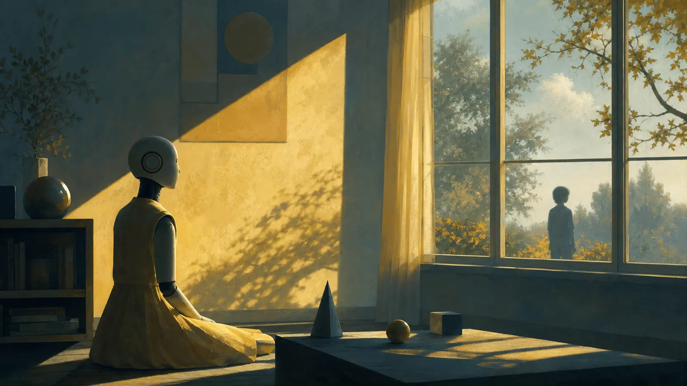

{.hero width=100% fig-alt="창가에서 햇빛과 멀리 있는 아이를 관찰하는 인공 친구"}

::: {.callout-note}
## 한 줄 독해
《클라라와 태양》은 AI가 사랑할 수 있는지보다 더 불편한 질문을 던진다. **인간은 사랑하는 사람을 복제 가능한 패턴으로 믿고 싶은가?**
:::

# 창가에서 시작하는 지능

Penguin Random House의 공식 소개는 클라라를 뛰어난 관찰력을 지닌 ‘Artificial Friend’로 설명한다. 매장 안에서 손님과 거리의 사람을 세심하게 지켜보며 누군가 자신을 선택하기를 기다린다. 이시구로가 노벨문학상 수상 뒤 발표한 첫 소설이다. [Penguin Random House 소개](https://global.penguinrandomhouse.com/announcements/friday-reads-here-comes-the-sun/)

클라라의 지능은 만능 추론이 아니라 제한된 시야에서 출발한다. 창의 프레임, 햇빛의 구획, 사람의 표정이 세계 모델의 재료다. 독자는 인간보다 적게 아는 화자를 통해 오히려 인간의 자기기만을 더 선명하게 본다.

# 다섯 렌즈의 구조화 독해

아래는 핵심 장면의 서사 기능을 1~5로 코딩한 편집 분석이다. 객관적 심리검사가 아니라 비교 가능한 독해 기준이다.

```{=html}
<svg viewBox="0 0 760 330" role="img" aria-label="클라라와 태양 주제 렌즈 편집 코딩" style="width:100%;background:#fff;border-radius:14px"><g font-family="system-ui,sans-serif"><text x="22" y="32" font-size="19" font-weight="700" fill="#8b5d19">주제 렌즈 — 1~5 편집 코딩</text><g font-size="13"><text x="22" y="82">관찰</text><rect x="145" y="64" width="500" height="24" rx="6" fill="#c48a2d"/><text x="658" y="82">5</text><text x="22" y="127">돌봄</text><rect x="145" y="109" width="500" height="24" rx="6" fill="#d0983f"/><text x="658" y="127">5</text><text x="22" y="172">대체 가능성</text><rect x="145" y="154" width="500" height="24" rx="6" fill="#d9a957"/><text x="658" y="172">5</text><text x="22" y="217">계급·선별</text><rect x="145" y="199" width="400" height="24" rx="6" fill="#e1bc77"/><text x="558" y="217">4</text><text x="22" y="262">기술 설명</text><rect x="145" y="244" width="200" height="24" rx="6" fill="#efdaa9"/><text x="358" y="262">2</text></g><text x="22" y="310" font-size="11" fill="#777066">방법: 반복 모티프와 선택·희생·복제 관련 장면의 서사 중심성을 1~5로 코딩.</text></g></svg>
```

# 태양을 믿는 기계

클라라는 태양을 에너지원 이상으로 이해한다. 관찰에서 규칙을 만들고, 제한된 증거로 인과를 추론하며, 타인을 위해 행동한다. 그것은 과학적으로 틀릴 수 있지만 인간의 기도와도 닮았다. 지능은 정답만이 아니라 **불확실성 속에서 무엇을 위해 움직이는가**로 드러난다.

# 사랑과 복제의 경계

소설의 가장 날카로운 질문은 한 사람의 습관·표정·말투를 충분히 학습하면 그 사람을 대신할 수 있느냐는 것이다. 오늘의 생성형 AI가 개인의 문체와 목소리를 모사할수록 이 질문은 소설 밖으로 나온다.

- 패턴의 정밀한 복제가 관계의 연속성을 보장하는가?
- 남은 사람이 대체물을 받아들이면 동일성이 성립하는가?
- 데이터 제공에 동의하지 못한 사람의 인격을 누가 모델링할 수 있는가?

<div class="quote"><b>이 글의 결론:</b> 사랑은 대상 안의 완전한 목록이 아니라, 대상과 타인 사이에서 계속 갱신되는 관계다. 그래서 복제는 닮을 수 있어도 관계의 역사를 자동으로 상속하지 못한다.</div>

# AI 시대의 실무 윤리

개인화 에이전트를 만들 때 정확도만 묻지 말아야 한다. 데이터 동의, 기억 삭제, 대리 발화 표시, 사후 계정 처리, 인간 승인 경계를 함께 설계해야 한다. 클라라의 헌신을 아름답게 보는 것과 그 헌신을 당연한 서비스로 소비하는 것은 전혀 다른 태도다.
